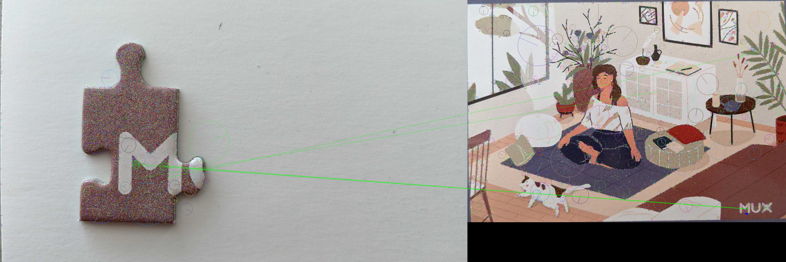

# puzzle-python-cv
Covid boredom w/puzzles leads to computer-vision puzzle hint generator

Uses Python 3.7 

# To build:

Create a virtual env to silo dependencies

`python -m venv env`

Activate virtual environment

`source env/bin/activate`

Install dependencies via requirements.txt file

`pip install -r requirements.txt`

# To run:

 Activate virtual environment

 `source env/bin/activate`

 Run function

 `python puzzle.py`

# To add additional dependencies:

Activate virtual environment

`source env/bin/activate`

Install new package

`pip install blah`

Freeze new dependency in requirements.txt file

`pip freeze > requirements.txt`

# To deploy to AWS lambda:

First follow the 'To build:' instructions above

Deactivate the virtual environment (if active)

`deactivate`

Create a ZIP archive with the function dependencies

`cd env/lib/python3.7/site-packages`

`zip -r9 ${OLDPWD}/function.zip .`

Add your function code to the archive

`cd $OLDPWD`

`zip -g function.zip puzzle.py`

Update the function code via AWS CLI (make sure your AWS cli is configured and credentialed)

`aws lambda update-function-code --function-name puzzle-hint-generator --zip-file fileb://function.zip`

